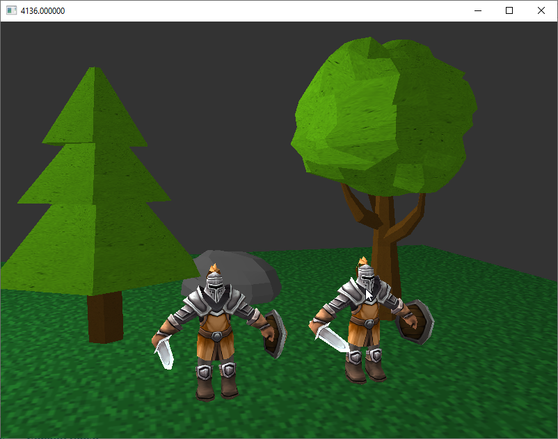

# Model3D Loader

## Spis treści
- [Opis](#opis)
- [Zrzuty ekranu](#zrzuty-ekranu)
- [Instalacja](#instalacja)
- [Technologie](#technologie)
- [Licencja](#licencja)

## Opis
**Model3D Loader** to program, który ma renderować modele trójwymiarowe.

## Zrzuty ekranu

## Instalacja
1. Pobierz i zainstaluje Visual Studio 2022
2. Pobierz i zainstaluje CMake
3. Pobierz bibliotekę GLFW 3.4 (https://www.glfw.org/) i umieść ją w katalogu `C:\glfw-3.4.bin.WIN64`.
4. Pobierz i zainstaluj bibliotekę Autodesk FBX SDK vs2022(https://aps.autodesk.com/developer/overview/fbx-sdk) i umieść ją w katalogu `C:\Program Files\Autodesk\FBX\FBX SDK\2020.3.7`
5. Otwórz **Wiersz poleceń (cmd)**.
6. Przejdź do katalogu projektu:
`
cd ..\..\Model3D Loader
`
7. Utwórz folder **build**:
`
mkdir build
`
8. Wejdź do folderu **build**:
`
cd build
`
9. Uruchom konfigurację projektu za pomocą **CMake**:
`
cmake ..
`
10. Zbuduj projekt:
`
cmake --build .
`

11. Plik wykonywalny znajdziesz w **build/Debug** lub **build/Release**

## Technologie
Program stworzono w języku C++ z wykorzystaniem bibliotek OpenGL 3.3.0, GLAD oraz GLFW 3.4.
  
## Licencja
**Licencja MIT**

Copyright (c) 2025 tBane

Niniejszym udziela się bezpłatnego pozwolenia każdej osobie, która uzyska kopię
tego oprogramowania i powiązanych plików dokumentacji („Oprogramowanie”), na obrót
Oprogramowaniem bez ograniczeń, w tym bez ograniczeń prawa
do korzystania, kopiowania, modyfikowania, łączenia, publikowania, dystrybuowania, udzielania sublicencji i/lub sprzedaży
kopii Oprogramowania oraz zezwalania osobom, którym Oprogramowanie jest
dostarczane, na takie działanie, z zastrzeżeniem następujących warunków:

Powyższa informacja o prawach autorskich i niniejsza informacja o zezwoleniu powinny być zawarte
we wszystkich kopiach lub znacznych częściach Oprogramowania.

OPROGRAMOWANIE JEST DOSTARCZANE „TAKIE, JAKIE JEST”, BEZ ŻADNEJ GWARANCJI, WYRAŹNEJ LUB
DOROZUMIANEJ, W TYM MIĘDZY INNYMI GWARANCJI PRZYDATNOŚCI HANDLOWEJ,
PRZYDATNOŚCI DO OKREŚLONEGO CELU I NIENARUSZALNOŚCI. W ŻADNYM WYPADKU
AUTORZY LUB POSIADACZE PRAW AUTORSKICH NIE PONOSZĄ ODPOWIEDZIALNOŚCI ZA ŻADNE ROSZCZENIA, SZKODY LUB INNĄ
ODPOWIEDZIALNOŚĆ...

---

Używane biblioteki stron trzecich:

To oprogramowanie używa następujących bibliotek stron trzecich:

- **GLAD** - licencjonowane na podstawie licencji MIT
- **GLFW** - licencjonowane na podstawie licencji zlib/libpng
- **GLM** - licencjonowane na podstawie licencji MIT
- **stb_image.h** - udostępnione w domenie publicznej (przez Seana Barretta)
- **FBX SDK** – własność firmy **Autodesk, Inc.**, używana zgodnie z **Autodesk FBX SDK License Agreement**.
FBX SDK może być używana wyłącznie do celów programistycznych i testowych. Jej redystrybucja jest zabroniona bez pisemnej zgody Autodesk.
Szczegółowe warunki licencji dostępne są na stronie:
https://www.autodesk.com/developer-network/platform-technologies/fbx-sdk-2020-0
Więcej informacji można znaleźć w odpowiednich plikach licencyjnych dołączonych do kodu źródłowego.